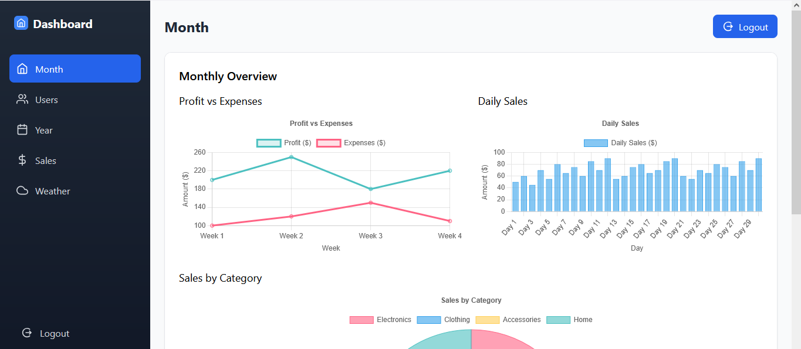

# 🌟 Dashboard Application


<p align="center">
  
</p>

## 📹 Google Drive Link

🔗 [Click here to watch the demo video](https://drive.google.com/file/d/1pfC0zxuOIeeOfQhlX8Lw8deht-av1IzN/view?usp=sharing)
---

## 🚀 Live Demo
🔗 [Live Website Link](https://dashboard-sigma-inky-99.vercel.app/)

---

## 🏷️ Badges


---

## 📋 Project Overview
This project is a modern **React.js Dashboard Application** that includes:
- **Admin Login System**
- **Sales, Profit, Loss** displayed beautifully with charts
- **Live Weather API Integration**
- Fully responsive and attractive design
- Data visualization using **Chart.js** and **Chart.js 2**
- Live deployment on **Vercel**

---

## 📜 Details
- Only authenticated admin can access the dashboard.
- Admin can **edit user details** easily.
- Sales, profit, and loss data are dynamically shown using **Chart.js**.
- Weather information fetched live using a **Weather API**.
- Protected routes ensure security.
- Smooth login and logout flow.
- Project deployed live using **Vercel** for fast performance.

---

## 🛡️ Admin Login Credentials

```bash
Email: admin@gmail.com
Password: admin
